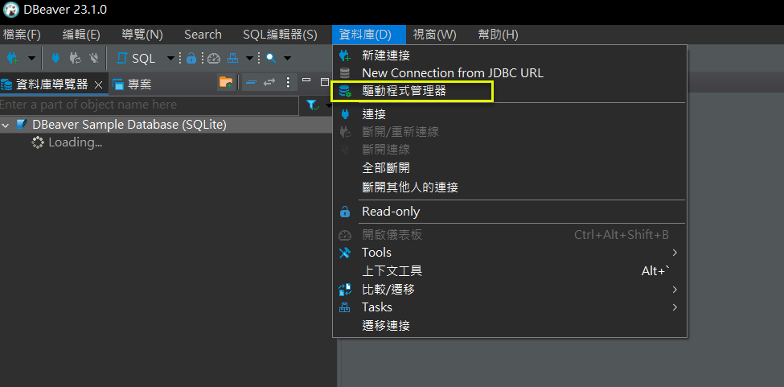

# 如何在 DBeaver Community Edition 23.1.0 連接至 SAP ASE 16.0

## 1. 前言
由於 SAP ASE 16.0 GUI 管理工具, 有的不再提供下載 (Sybase Central), 有的因為 Adobe Flash Player 停用, 而不再提供管理介面 (Cockpit), 有的則可能受限筆者的能力或環境, 一直安裝不起來 (AMC: Administration and Management Center), 故只好找看看有沒有第3方的免費工具可以使用.  
筆者找到了 DBeaver 這個以 Java 開發的工具, 它有 Community 及 Commercial 版本; 前者免費, 後者要付費. 當然, 付費可以有比較多的功能 (例如: 支援非關聯式資料來源, MongoDB, Redis ... 等).  
但就存取 SAP ASE 16.0 而言, Community Edition 已經足夠.  
安裝軟體看來很容易, 只要 [下一步] 就可無腦完成; 但在開始使用後, 筆者有遇到問題, 想說還是記錄一下. 

<!--more-->

## 目錄
* [1. 前言](#1-前言)  
* [2. 安裝環境](#2-安裝環境)  
* [3. 安裝過程](#3-安裝過程)  
* [4. 使用過程](#4-使用過程)  
* [5. 結論](#5-結論)  
* [6. 參考文件](#6-參考文件)  


## 2. 安裝環境
* Windows 10 22H2 Professional Edition  
* Oracle VirtualBox 7.0.6  
  * Windows 10 2004 Professional Edition  
  * Java Runtime 8u371  
  * Java Sdk 8u371  
    * 環境變數
    * JAVA_HOME   C:\Program Files\Java\jdk-1.8
    * JRE_HOME    C:\Program Files\Java\jre-1.8
    * PATH        C:\Program Files\Java\jre-1.8\bin;%PATH%


## 3. 安裝過程
大略就是執行安裝程式, 然後無腦 [下一步].  
  
  
  


## 4. 使用過程

1.. 執行桌面上的 DBeaver 捷徑.  

2.. 首次執行要開防火牆: [V]私人 [ ]公用.  
  

3.. 發生 Network unavailable 的處理方式.  
```plaintext
錯誤訊息:
network unavailable due to certificate issue:
javax.net.ssl.SSLHandshakeException:PKIX path building failed: sun.security.provider.certpath.SunCertPathBuilderException: unable to find valid certification path to requested target.
```
  
  
  

4.. 發生 無法下載對應的驅動程式 的處理方式.  
記得要開 NAT 網路 (in VirtualBox), 不然會無法下載對應的驅動程式.  

5.. 自行下載 SAP jConnect 驅動程式.  
  
  
  

6.. 連接 SAP ASE 16.0.  
  
  
  
  
  

7.. 利用 DBeaver 製作 ER Diagram.  
  
  
  


## 5. 結論 
DBeaver Community Edition 與 Toad for SAP (要付費) 相比, 缺少一些系統管理方面的功能 (Server Security, Server Objects ... 等), 但至少還是可以看到資料庫物件 (Table, View, Stored Procedure ... 等) 的結構, 比起在 SAP ASE 的 Interactive SQL 工具只能下指令, 來得好多了.   
故在缺乏 SAP ASE 支援或資源的狀況下, 仍不失為一個可行的替代方案.  

以下是 Toad for SAP 的截圖, 僅供參考.  
  


## 6. 參考文件

* <a href="https://dbeaver.io/download/" target="_blank">[1] {DBeaver) DBeaver Community Edition 下載頁面</a>

* <a href="https://en.wikipedia.org/wiki/DBeaver" target="_blank">[2] (Wiki) DBeaver</a>
> 這篇有提到 Community 與 Commercial 的差異:
> (1) Community: 主要支援關聯聯式資料庫.  
> (2) Commercial: Community + 支援非關聯聯式資料庫 (MongoDB, Redis ...).  

* <a href="https://github.com/dbeaver/dbeaver/issues/18175" target="_blank">[3] (GitHub) Network unavailable: javax.net.ssl.SSLHandshakeException</a>
> 這篇有提到發生 Network unavailable 的處理方式: UnCheck [ ] Use Windows trust store

* <a href="https://www.quest.com/register/55632/" target="_blank">[4] Toad for SAP solutions free trial 下載頁面</a>  


